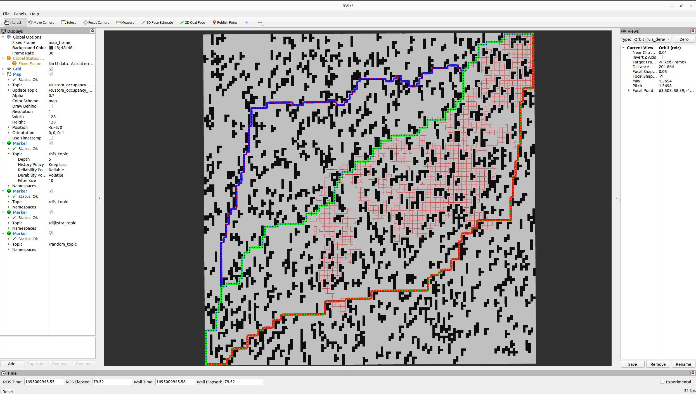
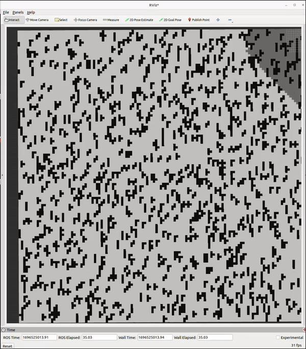
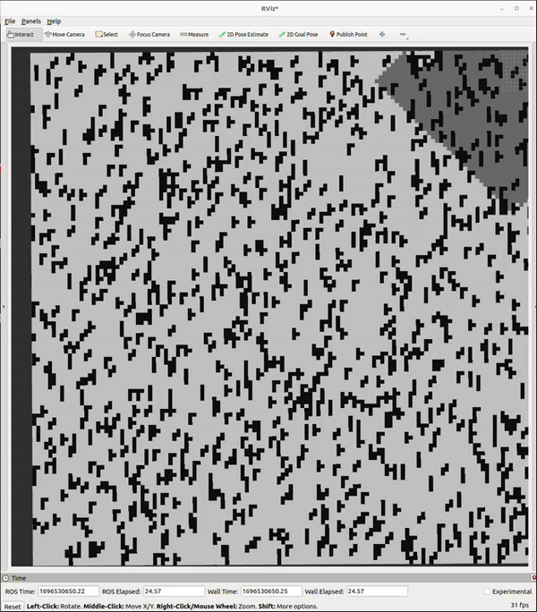
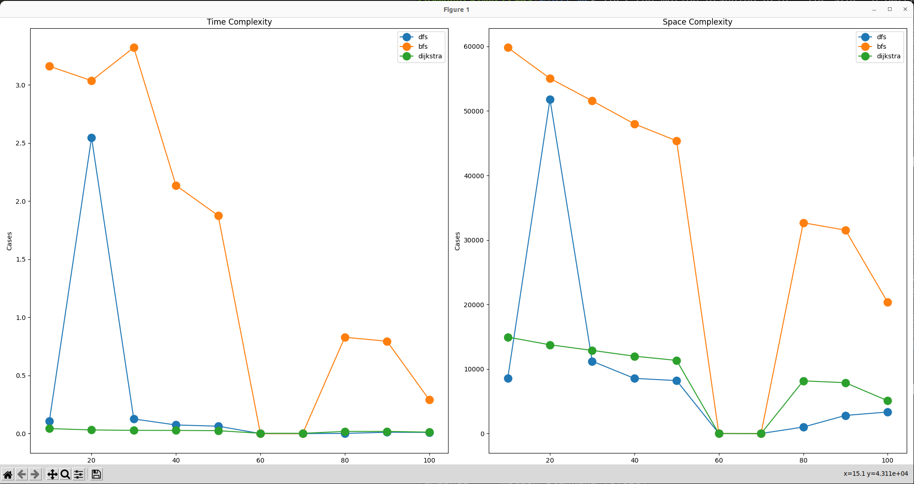
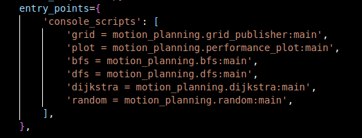

# motion_planning
This repository holds implementation for grid search algorithms used in robot motion planning: BSF, DSF and Dijkstra.  These are part of coursework of Motion Planning course at WPI. 

# ROS2_Grid_Search_Algorithms

<!-- PROJECT LOGO -->
 

  <a href="https://github.com/shambhurajmane/ROS2_Grid_Search_Algorithms">View Demo</a>
  ·
  <a href="https://github.com/shambhurajmane/ROS2_Grid_Search_Algorithms/issues">Report Bug</a>
  

<!-- ABOUT THE PROJECT -->
## About The Project

breadth first search Algorithm             |  Dijkstra's Algorithm  
:-------------------------:|:-------------------------:
 |  

* Instantiated a grid world with a configurable density of obstacles using tetrominoes as depicted in Figure.
* Implemented three forward search planning algorithms: depth first search, breadth first search, and Dijkstra’s.
* Created a random planner that simply moves to a random neighboring cell at each iteration.
* Produced a plot of the four implemented methods superimposed, showing the number of iterations to reach the goal versus obstacle density varied at a 10% step size from 0% to 100%.

(<a href="#readme-top">back to top</a>)

<!-- ABOUT THE PROJECT -->
## How to build and run tests
Please follow given steps to successfully run the whole project. I tried using launch file but rviz2 is mostly showing most recent data and not trying to synchronize all the marker visuals. So do follow the following sequence.

 Open a new terminal and source your ROS 2 installation so that ros2 commands will work.
 

Sr No | Command | Comment
--- | --- | --- 
1 | ros2 launch motion_planning launch.py | //To launch all (bfs, dfs, Dijkstra's and random) algorithm and grapg plotter
--- | --- | --- 
2 | ros2 run motion_planning grid --ros-args -p percent:=50 | //publish grid map

Graph will automatically genearte the performance of bfs, dfs and dijkstra algorithm, if grid is publishjed 10 times ir run grid node 10 times with 10 different percentage values.
The perfromance anlysis is done on the basis of time complexity and space complexity. 
In time complexity time taken by each algorithm to plan a path is considered.
In space complexity number of nodes visited before planning a path is considered.

(<a href="#readme-top">back to top</a>)

<!-- USAGE EXAMPLES -->
## Performance graph and analysis:

(<a href="#readme-top">back to top</a>)

Breadth First Search algorithm performed poorly when the obstacle percentage was less and shown good results when sapce became cluttered with obstacles. With increase in percenteage of obstacle the exploration of bfs decreases and the path is found in less time and less number of visited grids. 
Depth First Search algorithm performed realatively consistant with the environment obstacle percentage. but as seen in 2nd case, if the graph has cycles, dfs may take time to find a path or loop forever.  
Dijkstra algorithm on other hand shown a good performance in the basis of time and space. Though in grids exploration, dijkstra was little expensive than the dfs algorithm but the problem of getting lost in loop is not seen in case of dijkstra.  

# About code
<!-- GETTING STARTED -->
## Required dependencies to be added in package.xml

1) <exec_depend>rclpy</exec_depend>
2) <exec_depend>std_msgs</exec_depend>
3) <exec_depend>nav_msgs</exec_depend>
4) <exec_depend>turtlesim</exec_depend>
5) <exec_depend>geometry_msgs</exec_depend>
6) <exec_depend>visualization_msgs</exec_depend>
7) <exec_depend>ros2launch</exec_depend>

(<a href="#readme-top">back to top</a>)

### Required entry points to be added in setup.py

(<a href="#readme-top">back to top</a>)

### Working of nodes
1) Here I have created six nodes communicating with each other to plot a performance graph of search algorithms.
2) I have selected bfs, dfs and dijkstra algorithms for performance comparison.
3) Publishing occupancy grid:
This node publishes the node with random obstacles in the 128 * 128 grid. The obstacle percentage can be given as a parameter through the command line. Default value for the obstacle percentage is 30.
4) bfs algorithm:
This node subscribes to "custom_occupancy_grid" topic to get the grid occupancy status and uses the data to calculate the path from Northwest corner to southeast corner. Also it publishes the path on as a points and connecting lines on the "bfs_topic" and publishes the no of iterations on the "bfs_iterations" topic.
5) dfs algorithm:
This node subscribes to "custom_occupancy_grid" topic to get the grid occupancy status and uses the data to calculate the path from Northwest corner to southeast corner. Also it publishes the path on as a points and connecting lines on the "dfs_topic" and publishes the no of iterations on the "dfs_iterations" topic.
6) Dijkstra algorithm:
This node subscribes to "custom_occupancy_grid" topic to get the grid occupancy status and uses the data to calculate the path from Northwest Corner to southeast corner. Also it publishes the path on as a points and connecting lines on the "dijkstra_topic" and publishes the no of iterations on the "dijkstra_iterations" topic.
7) Random algorithm:
This node subscribes to "custom_occupancy_grid" topic to get the grid occupancy status and uses the data to calculate the path from Northwest Corner to southeast corner. Also it publishes the path on as a points and connecting lines on the "random_topic" and publishes the no of iterations on the "random_iterations" topic.
8) Performance plot
This node has a subscriber for all search algorithms to get the no of iteration they took for calculating the path. It plots the graph of obstacle percentage vs no of iterations done by respective search algorithms i.e. bfs, dfs and dijkstra, when 10 entries are received.

(<a href="#readme-top">back to top</a>)

